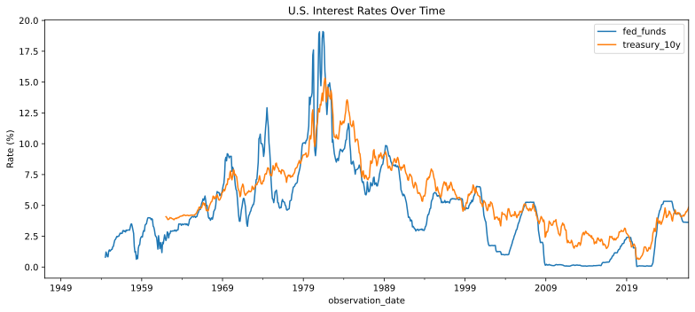
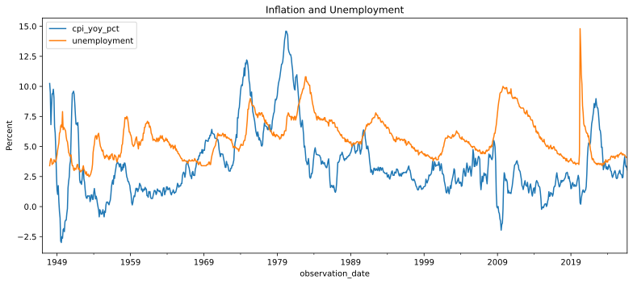
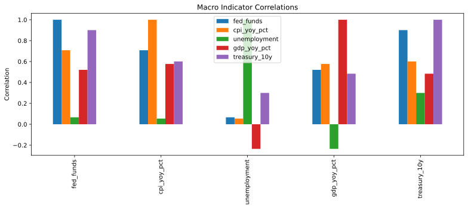
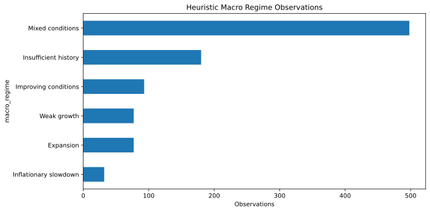

# Macro Market Intelligence

## Economic data → macro signals → decision context

A recruiter-ready **Data & Financial Analytics** project that turns public U.S. economic indicators into structured, decision-oriented analysis using Python, SQL, time-series analysis, feature engineering, statistics, and visualization.

> **Recruiter takeaway:** this project demonstrates the full chain from raw economic data to validated signals, analytical context, visual evidence, and a clearly communicated next question.

## Interactive Dashboard

Run the project as an interactive local dashboard:

```bash
pip install -r requirements.txt
streamlit run app.py
```

The dashboard lets users select a historical window and explore policy rates, 10Y Treasury yields, CPI, unemployment, GDP, and the latest rate spread. It automatically downloads and prepares the public economic data if the processed dataset is not present.

For a hosted version, deploy `app.py` on any Streamlit-compatible hosting service.

## The Business Problem

Economic indicators arrive at different frequencies and can tell different parts of the story. This project creates a repeatable framework for combining **interest rates, inflation, unemployment, GDP growth, and Treasury yields** into one analytical view.

### Questions the analysis answers

- How are policy and long-term rates evolving?
- Is inflation accelerating or cooling?
- Is growth strengthening or weakening?
- Is unemployment improving or deteriorating?
- How does the 10Y Treasury yield compare with the policy rate?
- Which indicators are accelerating or decelerating?
- Which historical relationships deserve further investigation?
- What broad historical macro regime does the combined evidence describe?

## Executive View

| Area | Output | Business use |
|---|---|---|
| **Rates** | Policy-rate + 10Y yield trends | Monetary-policy context |
| **Inflation** | YoY inflation + momentum | Price-pressure direction |
| **Growth** | YoY growth + momentum | Economic-cycle context |
| **Labor** | Unemployment trend | Labor-market context |
| **Yield curve** | 10Y minus policy-rate proxy | Rate-environment context |
| **Relationships** | Correlation analysis | Further-investigation questions |
| **Regimes** | Heuristic classification | Consistent historical segmentation |

## Visual Analysis

The charts below are generated by the project's real data pipeline and published back to the repository by GitHub Actions. They are committed as SVG so a recruiter can see the analytical output directly on GitHub without opening source code.









**[Open the Executive Dashboard](reports/executive_dashboard.md)** for the interpretation layer and methodological guardrails.

## Analytical Workflow

```text
Public Economic Data
        ↓
Validation & Frequency Alignment
        ↓
Derived Metrics & Feature Engineering
        ↓
Momentum / Z-Scores / Yield-Curve Proxy
        ↓
Correlation Analysis & Heuristic Regimes
        ↓
SQL + Visual Reporting
        ↓
Decision Framework
```

## What This Demonstrates

**Data preparation** — validation, frequency alignment, missing-value handling, documented transformations.

**Feature engineering** — YoY changes, three-month momentum, yield-curve proxy, standardized scores, derived indicators.

**Statistical reasoning** — historical correlation and comparison without confusing correlation with causation.

**Segmentation** — transparent, descriptive macro-regime classification.

**Business communication** — `Observation → evidence → relationship → uncertainty → next analytical question`.

## Tech Stack

**Python · pandas · NumPy · SQL · Matplotlib · Git/GitHub · GitHub Actions · Streamlit**

## Reproduce It

```bash
pip install -r requirements.txt
python src/download_data.py
python src/clean_data.py
python src/analyze_macro.py
```

## Repository Map

| Folder | Purpose |
|---|---|
| `app.py` | Interactive Streamlit dashboard |
| `reports/` | Executive interpretation |
| `docs/` | Methodology, data dictionary, decision framework |
| `sql/` | Reusable analytical queries |
| `src/` | Reproducible pipeline |
| `outputs/charts/` | Recruiter-visible analytical charts |
| `.github/workflows/` | Automated validation and chart publication |

## Guardrails

- Public economic data only.
- Derived metrics are distinguished from official releases.
- Macro regimes are heuristic and descriptive, not predictive.
- Correlation does not establish causation.
- This is an analytical portfolio project, not investment advice.

## Portfolio

Part of a three-project analytics portfolio:

- **Macro Market Intelligence** — economic and market context
- **Trading Risk & Performance Analytics** — financial risk and performance
- **Customer Support Analytics** — business and operations analytics
